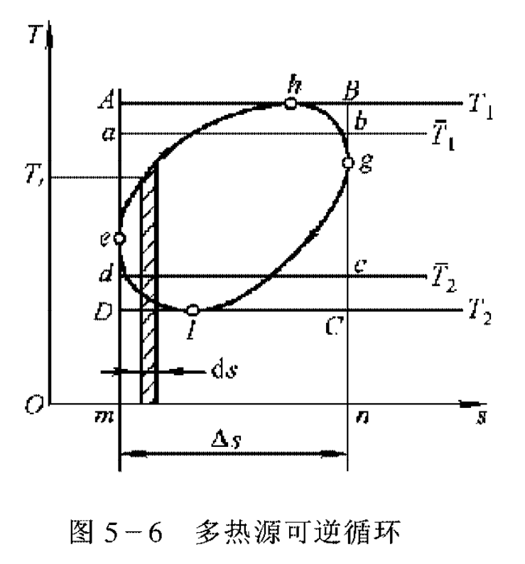

* ###### 前言
* ###### 目录
* ###### 主要符号
* ###### 绪论
    * ###### 0-1 热能及其利用
        * ###### 热能利用的两种基本形式：热利用和热能的动力利用
        * ###### 燃料的化学能
        * ###### 热能通过热能动力装置转换为机械能的效率较低
        * ###### 热能或燃料化学能直接转换为电能的方法，如磁流体发电、太阳能电池、燃料电池等
        * ###### 热力学：研究物质的能量、能量传递和转換以及能量与物质性质之间普遍关系的科学
    * ###### 0-2 热力学发展简史
        * ###### 热力学第一定律：能量守恒，第一类永动机(即不消耗能量的永动机)是不可能实现的。
        * ###### 热力学第二定律：第二类永动机(只从一个热源吸热的永动机)是不可能实现的。
        * ###### 热力学第三定律：绝对零度不能达到原理
    * ###### 0-3 工程热力学的主要内容及研究方法
        * ###### 主要内容
            * ###### 基本概念与基本定律,如热力系统、状态参数、平衡态、热力学第一定律、热力学第二定律,等等
            * ###### 热力过程和循环的分析研究及计算方法：能量的转化过程特别是热能转化为机械能是由工质的吸热、膨胀、排热等状态变化过程的实现
            * ###### 常用工质的性质
            * ###### 化学热力学：燃烧及燃料电池等新型能量转换技术及有关环境问题的研究与化学过程有关
        * ###### 宏观热力学、经典热力学：
            * ###### 以第一、第二定律等基本定律为基础，采用抽象、概括、理想化和简化的方法，抽出共性，突出本质，建立模型，推导公式，得到结论。由于热力学基本定律的可靠性及普适性，所以宏观研究方法可以得到可靠的结果。
            * ###### 局限性：由于不考虑物质微观结构及微粒的运动规律,所以由之建立的热力学宏观理论并不能说明热现象的本质及其内在原因
        * ###### 微观热力学、统计热力学：
            * ###### 应用统计法则和概率法则的研究方法
            * ###### 从物质是由大量分子和原子等粒子所组成的事实出发,将宏观性质作为在一定宏观条件下大量分子和原子的相应微观量的统计平均值,利用量子力学和统计方法,将大量粒子在一定宏观条件下一切可能的微观运动状态予以统计平均,来阐明物质的宏观特性,导出热力学基本规律,因而能阐明热现象的本质,解释“张落”现象。在对分子结构作出模型假设后,利用统计热力学方法还可对这种物质的具体热力学性质作出预测。
            * ###### 局限性：因为对分子微观结构的假设只能是近似的,因此尽管运用了繁复的数学运算,所求得的理论结果往往不够精确
* ###### 第一章 基本概念
    * ###### 1-1 热能在热机中转变成机械能的过程
        * ###### 热能动力装置：蒸汽动力装置、燃气动力装置两大类
        * ###### 工程热力学不深入研究各种热机的具体结构和各自的特性,而是抽取所有热机的共同问题进行讨论。
        * ###### 吸热、膨胀作功、排热对任何一种热能动力装置都是共同的，也是本质性的。
        * ###### 工质
        * ###### 热源、高温热源
        * ###### 冷源、低温热源
    * ###### 1-2 热力系统
        * ###### 热力系统、外界、边界
        * ###### 闭口系统、控制质量
        * ###### 开口系统、控制容积、控制体
        * ###### 绝热系统、孤立系统
    * ###### 1-3 工质的热力学状态及其基本状态参数
        * ###### 状态、工质的热力学状态：工质在热力变化过程中的某一瞬间所呈现的宏观物理状态
        * ###### 状态参数：描述工质所处状态的宏观物理量
        * ###### 一、温度
            * ###### 微观：温度标志物质分子热运动的激烈程度
                * ###### 气体：大量分子平移动能平均值的量度
            * ###### 温度计、经验温标
            * ###### 摄氏度：t = T - 273.15 K
        * ###### 二、压力
            * ###### 各压力单位间的转换
        * ###### 三、比体积及密度
        * ###### 比体积：v = \frac { V } { m }
        * ###### 密度：\rho = \frac { m } { V }
    * ###### 1-4 平衡状态、状态方程式、坐标图
        * ###### 一、平衡状态：平衡的充要条件:系统内部及系统与外界之间不存在势差。热力学中的势差( Potential)包括：压力差、温度差、化学势差
            * ###### 均匀并非系统处于平衡状态的必要条件
            * ###### 与化学平衡概念相似
        * ###### 二、状态方程式
        * ###### 三、状态参数坐标图
    * ###### 1-5 工质的状态变化过程
        * ###### 一、准平衡过程（准静态过程）
        * ###### 二、可逆过程和不可逆过程
            * ###### 可逆过程的基本特征：首先应是准平衡过程,应满足热的和力的平衡条件，同时在过程中不应有任何耗散效应。
            * ###### 准平衡过程和可逆过程的区别：
                * ###### 是否考虑外界，准平衡过程只着眼于工质内部的平衡，可能发生能量耗散；而可逆过程不仅要求工质内部是平衡的，还要求工质与外界的作用可以无条件地逆复，过程进行时不存在任何能量的耗散。
                * ###### 可逆过程必然是准平衡过程,而准平衡过程只是可逆过程的必要条件
    * ###### 1-6 过程功和热量
        * ###### 一、功的热力学定义
            * ###### 力与微小位移的积：\delta W = F d x
        * ###### 二、可逆过程的功
            * ###### 膨胀功、压缩功：体积变化功
            * ###### \delta W = F d x = p A d x = p d V
            * ###### 示功图
                * >  [[P28]](bookxnotepro://opennote/?nb={98246b2e-7cbf-4db8-bb2b-82736e66f521}&book=53dd36b829595b98087cd1522c5725d4&page=28&x=405&y=494&id=808)
            * ###### 功不是状态参数,是过程量,不能表示为状态参数的函数
            * ###### 有用功、摩擦功及排斥大气功
            * ###### W _ { u } = W  - W _ { 1 }- W _ { r }
        * ###### *三、广义功简介
            * ###### 1、固体中弹性力作功
            * ###### 2、液体表面张力作功：表面张力×薄膜面积变化
            * ###### 3、电极化功：电场强度与容积电极化强度变化的级
            * ###### 4、磁化功
            * ###### 广义功、广义力、广义坐标
            * ###### \delta W = \sum F d x
        * ###### 四、过程热量
            * ###### \delta q = T d s
                * >  [[P32]](bookxnotepro://opennote/?nb={98246b2e-7cbf-4db8-bb2b-82736e66f521}&book=53dd36b829595b98087cd1522c5725d4&page=32&x=402&y=431&id=809)
            * ###### 功和热量的区别：
                * ###### 功是有规则的宏观运动能量的传递，在作功过程中往往伴随着能量形态的转化；
                * ###### 热量则是大量微观粒子杂乱热运动的能量的传递，传热过程中不出现能量形态的转化。
                * ###### 功转变成热量是无条体的，而热转变成功是有条件的。
    * ###### 1-7 热力循环
        * ###### 一、循环概说
        * ###### 二、正向循环：热动力循环
        * ###### 三、逆向循环
            * ###### 制冷系数、热泵系数、供热系数
* ###### 第二章 热力学第一定律
    * ###### 2-1 热力学第一定律的实质
        * ###### 能量守恒：能量不能被创造，可以在不同形态间转化，转化过程中总量保持不变
    * ###### 2-2 热力学能和总能
        * ###### 一、热力学能
            * ###### 热力学能：内动能、内位能及维持一定分子结构的化学能和原子核内部的原子能，以及电磁场作用下的电磁能等
            * ###### 内动能：分子的平移运动、旋转运动和振动运动，取决于气体的温度
            * ###### 内位能：分子间作用力导致的势能，取决于气体的比体积和温度
            * ###### 符号U，单位J、焦耳；u，J/kg
            * ###### 内部储存能
        * ###### 二、总能
            * ###### 位能->势能
            * ###### 外部储存能：宏观速度导致的动能、高度导致的位能
            * ###### E = U + E _ { k } + E _ { p }
    * ###### 2-3 能量的传递和转化
        * ###### 一、作功和传热
        * ###### 二、推动功（pv）和流动功（\Sum pv）
            * ###### 推动功：界面流过的工质为通过界面需要将原有工质移出而需要的功
              

              ------

            * ###### 流动功：工质流进流出开口系所需要的功，为界面推动功的累加
              

              ------

    * ###### 2-4 焓：组合参数，热力学能u与推动功pv的和，随工质进出的能量总包括工质的内能和维持工质进出系统的推动功
        * ###### 工质通过一定的界面流入热力系统时，进入系统的能量包括工质自身的能量（热力学能u）和外部功源为使工质进入系统做的流动功，即随工质进入系统的能量为热力学能+推动功，即为比焓
    * ###### 2-5 热力学第一定律的基本能量方程式
        * ###### 闭口系和开口系热力学第一定律的区别：闭口系没有物质进出，而开口系有物质的进出
        * ###### 能量方程：进入系统能量-离开系统能量=系统中储存的能量变化量，\delta Q - \delta W = \delta E
        * ###### 忽略系统的宏观动能和位能，系统储存能只剩下热力学能U
        * ###### 可逆过程：q = u + pdv，热能转换为功(机械能)的唯一途径是体积变化功
        * ###### \delta q = d u + \delta w，\delta和d的区别在于：q和w是过程量，变化量与过程有关，不能微分；而u是状态参数，变化与过程无关，可微分
        * ###### 热力学第一定律的基本能量方程式：(1)初终状态应是平衡态。  (2)公式中热量、功量是代数值。  (3)量纲要統一。  (4)物理意义：  q-△u=w  真正反映了热功转換,它表明加给系統的热量一部分用于增加工质的热力学能,仍以热能的形式储存于工质内部,余下的一部分以作功的方式传递给外界,转化为机械能。
    * ###### 2-6 开口系统能量方程式
        * ###### 控制容积
        * ###### 一、开口系能量方程
            * ###### 内部功、轴功、摩擦损失
            * ###### 进入系统能量-离开系统能量=控制容积的储存能增量
        * ###### 二、稳定流动能量方程：稳定是时间概念，参数不随时间变化，而非没有势差
            * ###### 不稳定流动或瞬变流动过程
            * ###### 稳定流动讨程：热力系任何截面上工质的一切参数都不随时间而变
            * ###### \frac { d E_{c v }} { d \tau } = 0 , \quad \sum q_{ m , i n} = \sum q _{m ,out}
            * ###### 稳定流动能量方程式
              开口系与闭口系是相对的

              ------

              

              ------

        * ###### 三、稳定流动能量方程式的分析
            * ###### 膨胀功=流动功（维持工质流动）+技术功（工质宏观动能+宏观位能+工质对机器做功）
              

              ------

            * ###### 热力学第一定律热变功的实质：热能转变而来的机械能总等于膨胀功
            * ###### 可逆过程的技术功：\delta w _ { t } = - v d p
                * >  [[P49]](bookxnotepro://opennote/?nb={98246b2e-7cbf-4db8-bb2b-82736e66f521}&book=53dd36b829595b98087cd1522c5725d4&page=49&x=402&y=309&id=810)
    * ###### 2-7 能量方程式的应用
        * ###### 一、动力机
        * ###### 二、压气机
        * ###### 三、换热器
        * ###### 四、管道
        * ###### 五、节流
* ###### 第三章 理想气体性质
    * ###### 3-1 理想气体的概念
        * > 理想气体两点假设：1、分子是些弹性的、不具体积的质点；2、分子间相互没有作用カ [[P58]](bookxnotepro://opennote/?nb={98246b2e-7cbf-4db8-bb2b-82736e66f521}&book=53dd36b829595b98087cd1522c5725d4&page=58&x=496&y=414&id=775)

    * ###### 3-2 理想气体状态方程式
        * ###### 一、理想气体的状态方程式：克拉贝龙( Clapeyron)方程
            * > 气体常数 R_g：只与其他种类相关，与气体状态无关 [[P59]](bookxnotepro://opennote/?nb={98246b2e-7cbf-4db8-bb2b-82736e66f521}&book=53dd36b829595b98087cd1522c5725d4&page=59&x=499&y=478&id=776)

        * ###### 二、摩尔质量和摩尔体积
        * ###### 三、摩尔气体常数
            * ###### 摩尔气体常数=摩尔质量×气体常数 R=MR_g
            * ###### 摩尔气体常数是与状态、气体种类无关的普适恒量
    * ###### 3-3 理想气体的比热容
        * ###### 一、比热容的定义
            * > 比热容/质量热容：1kg物质温度升高1K(或1℃)所需的热量：c = \frac { \delta q } { d T } \quad c = \frac { { \delta q } { d t } [[P63]](bookxnotepro://opennote/?nb={98246b2e-7cbf-4db8-bb2b-82736e66f521}&book=53dd36b829595b98087cd1522c5725d4&page=63&x=506&y=141&id=777)

            * > 由于热量是过程量,因而比热容也和过程特性有关、不同的热力过程比热容也不相同。 [[P63]](bookxnotepro://opennote/?nb={98246b2e-7cbf-4db8-bb2b-82736e66f521}&book=53dd36b829595b98087cd1522c5725d4&page=63&x=503&y=248&id=778)

            * > 定容比热容：c_v = ( \frac { \partial q } { d T } ) _ { v } = ( \frac { d u + p d v } { d T } ) _ { v } = ( \frac { \partial u } { \partial T } ) _ { v } [[P63]](bookxnotepro://opennote/?nb={98246b2e-7cbf-4db8-bb2b-82736e66f521}&book=53dd36b829595b98087cd1522c5725d4&page=63&x=522&y=352&id=779)

            * > 定压比热容：c _ { p } = ( \frac { \partial q } { d T } ) = ( \frac { d h - v d q } { d T } ) _ { p } = ( \frac { \partial h } { \partial T } ) [[P63]](bookxnotepro://opennote/?nb={98246b2e-7cbf-4db8-bb2b-82736e66f521}&book=53dd36b829595b98087cd1522c5725d4&page=63&x=527&y=397&id=780)

            * > 理想气体的比热容：c _ { V } = \frac { d u } { d T } } ,{ c _ { p } = \frac { d h } { d T } [[P63]](bookxnotepro://opennote/?nb={98246b2e-7cbf-4db8-bb2b-82736e66f521}&book=53dd36b829595b98087cd1522c5725d4&page=63&x=509&y=581&id=781)

        * ###### 二、定压热容与定容热容的关系
            * ###### 迈耶公式：c _ { p } - c _ { p } = R _ { g }
        * ###### 三、利用比热容计算热量
            * ###### 1.真实比热容：拟合的多项式
            * ###### 2.平均比热容表：根据真实比热容曲线面积进行计算
            * ###### 3.平均比热容直线关系式：拟合为一次关系式
            * ###### 4.定值比热容：分子自由度
    * ###### 3-4 理想气体的热力学能、焓和熵
        * ###### 一、热力学能和焓
            * > 根据热力学第一定律解析式：q = \Delta u + \int p d v , \quad q = \Delta h - \int v d p，定容过程膨胀功=0，过程热量=热力学能变化；定压过程技术功=0，过程热量=焓变化
d u = c_V d t = c_V d T
d h = c _ { p } d t = c _ { p } d T [[P71]](bookxnotepro://opennote/?nb={98246b2e-7cbf-4db8-bb2b-82736e66f521}&book=53dd36b829595b98087cd1522c5725d4&page=71&x=469&y=221&id=785)

            * ###### 由于热力学能和焓都是温度的单值函数，所以这两个状态间的热力学能差和焓差便已确定，而与实现状态变化的过程无关。因此，任何一个过程的热力学能变化与相同温度变化时的定容过程热力学能变化相等；任何一个过程的焓变化，与具有相同温度变化的定压过程焓变化相等。其中，定容过程和定压过程是过程的特例而已。
            * > 根据定容比热容和定压比热容定义的热力学能和焓的表达式，理想气体可逆过程的热力学第一定律可具体化为：
\delta q = c_V d T + p d v
\delta q = c_p d T - v d p [[P72]](bookxnotepro://opennote/?nb={98246b2e-7cbf-4db8-bb2b-82736e66f521}&book=53dd36b829595b98087cd1522c5725d4&page=72&x=530&y=118&id=789)

            * > 热工计算中只要求确定过程中热力学能或焓值的变化量，认为规定基点，热力学能与焓值根据迈耶公式确定：如0℃时，h_{0°C}=0 kJ/Kg，则u_{0°C} = -273.15R_g [[P71]](bookxnotepro://opennote/?nb={98246b2e-7cbf-4db8-bb2b-82736e66f521}&book=53dd36b829595b98087cd1522c5725d4&page=71&x=530&y=481&id=788)

        * ###### 二、状态参数熵
            * > 根据理想气体可逆过程热力学第一定律解析式和理想气体状态方程及熵的定义式：
d s = \frac { c _ { p } d T - v d p } { T } = c _ { p } \frac { d T } { T } - R _ { g } \frac { d p } { t }
d s = \frac { c_V d T + p d v } { T } = c_V \frac { d T } { T } + R _ { g } \frac { d v } { v }
根据理想气体状态方程微分方程\frac { d p } { p } + \frac { d v } { v } = \frac { d T } { T }及迈耶公式：d s = c_V \frac { d p } { p } + c _ { p } \frac { d v } { v } [[P72]](bookxnotepro://opennote/?nb={98246b2e-7cbf-4db8-bb2b-82736e66f521}&book=53dd36b829595b98087cd1522c5725d4&page=72&x=530&y=363&id=791)

        * ###### 三、理想气体的熵变计算
            * ###### 熵根据热量和温度来定义，则不同的热量表达式推导出不同的熵表达式
            * ###### (1) 使用平均比热容表
            * ###### (2) 使用气体热力性质表
            * ###### (3) 使用真实热容经验式
            * ###### (4) 使用比热容算术平均值
    * ###### 3-5 理想气体混合物
        * ###### 一、混合气体的折合摩尔质量和折合气体常数
            * ###### 根据摩尔气体常数计算折合气体常数
        * ###### 二、分压力定律和分体积定律
            * ###### 道尔顿分压定律：理想气体混合物各组分的分压力等于其摩尔分数与总压力的乘积
            * ###### 亚美格( Amagat)分体积定律：理想气体的分体积之和等干混合气体的总体积
            * ###### 只适用于理想气体状态
        * ###### 三、wi、xi、φi的换算关系
            * ###### 质量分数、摩尔分数、体积分数
        * ###### 四、理想气体的比热容、热力学能、焓和熵：各混合物量的加和
            * ###### 1.比热容
            * ###### 2.热力学能和焓
            * ###### 3.熵
* ###### 第四章 理想气体的热力过程：根据理想气体热力学第一定律解析式进行各种推导
    * ###### 4-1 研究热力过程的目的及一般方法
    * ###### 4-2 定容过程
        * > 热量不转换为机械能，全部变为热力学能增量 [[P92]](bookxnotepro://opennote/?nb={98246b2e-7cbf-4db8-bb2b-82736e66f521}&book=53dd36b829595b98087cd1522c5725d4&page=92&x=533&y=583&id=804)

    * ###### 4-3 定压过程
        * > 定压过程不对外输出技术功，热能转换的机械能全部为流动功，以维持工质流动 [[P94]](bookxnotepro://opennote/?nb={98246b2e-7cbf-4db8-bb2b-82736e66f521}&book=53dd36b829595b98087cd1522c5725d4&page=94&x=529&y=563&id=806)

        * > T-S图斜率\frac { \partial T } { \partial s }：
根据理想气体热力学第一定律解析式及熵定义式，
定容过程：( \frac { \partial T } { \partial s } ) _ { v } = \frac { T } { c _ { V } }
定压过程：( \frac { \partial T } { \partial s } ) _ { p } = \frac { T } { c _ { p } }
由于定容和定压比热容关系，所以在T-S图上定压线较定容线平坦 [[P94]](bookxnotepro://opennote/?nb={98246b2e-7cbf-4db8-bb2b-82736e66f521}&book=53dd36b829595b98087cd1522c5725d4&page=94&x=524&y=164&id=807)

    * ###### 4-4 定温过程
        * > 定温过程即定热力学能过程、定焓过程 [[P99]](bookxnotepro://opennote/?nb={98246b2e-7cbf-4db8-bb2b-82736e66f521}&book=53dd36b829595b98087cd1522c5725d4&page=99&x=497&y=422&id=811)

        * > 定温过程的热量和过程功的数值相等，符号相同；
由于根据理想气体方程知，进出系统推动功不变，所以流动功为0，吸热量全部转变为技术功 [[P100]](bookxnotepro://opennote/?nb={98246b2e-7cbf-4db8-bb2b-82736e66f521}&book=53dd36b829595b98087cd1522c5725d4&page=100&x=529&y=136&id=812)

    * ###### 4-5 绝热过程
        * > 根据两个理想气体第一定律解析式得到定熵过程方程式：
\frac { d p } { p } = - \frac { c _ { p } } { c _ { v } } \frac { d v } { v }
\frac { d p } { p } + \gamma \frac { d v } { v } = 0
一般绝热过程：
\frac { d p } { p } + k \frac { d v } { v } = 0
定熵指数：k = - \frac { v } { p } ( \frac { \partial p } { \partial v } )_{s} [[P101]](bookxnotepro://opennote/?nb={98246b2e-7cbf-4db8-bb2b-82736e66f521}&book=53dd36b829595b98087cd1522c5725d4&page=101&x=527&y=138&id=813)

        * > p-v图斜率：\frac { \partial p } { \partial v }
定温过程：( \frac { \partial p } { \partial v } ) _ { T } = - \frac { p } { v }
定熵过程：( \frac { \partial p } { \partial v } ) _ { S } = - k\frac { p } { v }
定熵指数k>1，所以定熵线更陡 [[P102]](bookxnotepro://opennote/?nb={98246b2e-7cbf-4db8-bb2b-82736e66f521}&book=53dd36b829595b98087cd1522c5725d4&page=102&x=520&y=385&id=815)

        * > 绝热过程中工质与外界无热量交换,过程功只来自工质本身的热量转换
绝热过程的技术功=焓降 [[P103]](bookxnotepro://opennote/?nb={98246b2e-7cbf-4db8-bb2b-82736e66f521}&book=53dd36b829595b98087cd1522c5725d4&page=103&x=531&y=108&id=816)

    * ###### 4-6 多变过程
        * > 过程方程式：p v ^ { n } =C [[P105]](bookxnotepro://opennote/?nb={98246b2e-7cbf-4db8-bb2b-82736e66f521}&book=53dd36b829595b98087cd1522c5725d4&page=105&x=324&y=329&id=817)

        * > 初、终态参数的关系：过程方程式及理想气体状态方程 [[P105]](bookxnotepro://opennote/?nb={98246b2e-7cbf-4db8-bb2b-82736e66f521}&book=53dd36b829595b98087cd1522c5725d4&page=105&x=332&y=581&id=818)

        * > 过程功、技术功及过程热量
过程功：w = \int _ { 1 } ^ { 2 } p d v
技术功：w _ { t } = - \int _ { 1 } ^ { 2 } v d p
技术功是过程功的n倍
热力学能：\Delta u = c _ { V } ( T _ { 2 } - T _ { 1 } )
过程热量：根据第一定律，由热力学能和过程功求热量，q= \frac { n - k } { n - 1 } c _ { V } ( T _ { 2 } - T _ { 1 } ) [[P106]](bookxnotepro://opennote/?nb={98246b2e-7cbf-4db8-bb2b-82736e66f521}&book=53dd36b829595b98087cd1522c5725d4&page=106&x=496&y=245&id=819)

        * > 功热关系：
\frac { w } { q } = \frac { k - 1 } { k - n }
由于k-1>0，根据k与n关系及压缩和膨胀导致的w正负出现不同情况 [[P107]](bookxnotepro://opennote/?nb={98246b2e-7cbf-4db8-bb2b-82736e66f521}&book=53dd36b829595b98087cd1522c5725d4&page=107&x=429&y=468&id=821)

        * > 定容、定压、定温和定熵均为多变过程特例：
定压n=0
定温n=1
定熵n=k
定容n=∞ [[P108]](bookxnotepro://opennote/?nb={98246b2e-7cbf-4db8-bb2b-82736e66f521}&book=53dd36b829595b98087cd1522c5725d4&page=108&x=421&y=311&id=822)

        * > p-v图斜率：根据过程方程式微分形式得到，\frac { d p } { d v } = - n \frac { p } { v }，同一点p、v相同，斜率只与n有关
T-s图斜率：根据熵定义式及过程热量表达式得到，\frac { d T } { d s } = \frac { T } { c _ { n } } = \frac { n - 1 } { ( n - k ) c _ { V } } T，也只与n有关 [[P108]](bookxnotepro://opennote/?nb={98246b2e-7cbf-4db8-bb2b-82736e66f521}&book=53dd36b829595b98087cd1522c5725d4&page=108&x=510&y=505&id=823)

            * >  [[P108]](bookxnotepro://opennote/?nb={98246b2e-7cbf-4db8-bb2b-82736e66f521}&book=53dd36b829595b98087cd1522c5725d4&page=108&x=280&y=545&id=824)
    * ###### *4-7 非稳态流动过程
* ###### 第五章 热力学第二定律
    * ###### 5-1 热力学第二定律
        * ###### 一、自然过程的方向性
            * > 功热转化：耗散效应 [[P130]](bookxnotepro://opennote/?nb={98246b2e-7cbf-4db8-bb2b-82736e66f521}&book=53dd36b829595b98087cd1522c5725d4&page=130&x=226&y=454&id=825)

            * > 有限温差传热 [[P131]](bookxnotepro://opennote/?nb={98246b2e-7cbf-4db8-bb2b-82736e66f521}&book=53dd36b829595b98087cd1522c5725d4&page=131&x=245&y=98&id=826)

            * > 自由膨胀 [[P131]](bookxnotepro://opennote/?nb={98246b2e-7cbf-4db8-bb2b-82736e66f521}&book=53dd36b829595b98087cd1522c5725d4&page=131&x=224&y=193&id=827)

            * > 混合过程 [[P131]](bookxnotepro://opennote/?nb={98246b2e-7cbf-4db8-bb2b-82736e66f521}&book=53dd36b829595b98087cd1522c5725d4&page=131&x=224&y=284&id=828)

            * > 有限势差 [[P131]](bookxnotepro://opennote/?nb={98246b2e-7cbf-4db8-bb2b-82736e66f521}&book=53dd36b829595b98087cd1522c5725d4&page=131&x=499&y=372&id=835)

            * > 自发过程、非自发过程 [[P131]](bookxnotepro://opennote/?nb={98246b2e-7cbf-4db8-bb2b-82736e66f521}&book=53dd36b829595b98087cd1522c5725d4&page=131&x=530&y=415&id=831)

        * ###### 二、热力学第二定律的表述
            * > 克劳修斯表述：热量传递方向性的角度：热不可能自发地、不付代价地从低温物体传至高温物体 [[P132]](bookxnotepro://opennote/?nb={98246b2e-7cbf-4db8-bb2b-82736e66f521}&book=53dd36b829595b98087cd1522c5725d4&page=132&x=533&y=119&id=836)

            * > 开尔文表述：本质上反映了热能和机械能的差别：不可能制造出从单一热源吸热、使之全部转化为功而不留下其他任何变化的热力发动机，即第二类永动机是不存在的 [[P132]](bookxnotepro://opennote/?nb={98246b2e-7cbf-4db8-bb2b-82736e66f521}&book=53dd36b829595b98087cd1522c5725d4&page=132&x=528&y=463&id=837)

    * ###### 5-2 可逆循环分析及其热效率
        * ###### 一、卡诺循环：绝热压缩、定温吸热、绝热膨胀、定温放热
            * >  [[P133]](bookxnotepro://opennote/?nb={98246b2e-7cbf-4db8-bb2b-82736e66f521}&book=53dd36b829595b98087cd1522c5725d4&page=133&x=283&y=486&id=838)
            * > 卡诺循环的热效率：\eta _ { c } = 1 - \frac { T _ { 2 } } { T _ { 1 } }
T_1、T_2分别为高温、低温热源温度
1、提高温差可以提高热效率
2、效率只能小于1
3、热源温度相等时，循环效率为0，验证第二类永动机不存在，表明温度平衡体系热能不能转化为机械能 [[P134]](bookxnotepro://opennote/?nb={98246b2e-7cbf-4db8-bb2b-82736e66f521}&book=53dd36b829595b98087cd1522c5725d4&page=134&x=482&y=268&id=839)

        * ###### 二、概括性卡诺循环：双热源间的极限回热循环，在两热源定温吸、放热，在膨胀和压缩过程中无温差传热，循环中膨胀压缩过程总传热为0，实现可逆
            * >  [[P135]](bookxnotepro://opennote/?nb={98246b2e-7cbf-4db8-bb2b-82736e66f521}&book=53dd36b829595b98087cd1522c5725d4&page=135&x=281&y=522&id=841)
        * ###### 三、逆向卡诺循环
        * ###### 四、多热源的可逆循环：无穷多热源，保证工质与热源时时无温差传热，实现循环可逆
            * >  [[P137]](bookxnotepro://opennote/?nb={98246b2e-7cbf-4db8-bb2b-82736e66f521}&book=53dd36b829595b98087cd1522c5725d4&page=137&x=388&y=157&id=843)
            * > 因此可得出结论:工作于两个热源间的一切可逆循环(包括卡诺循环)的热效率高于相同温限回多热源的可逆循环。 [[P137]](bookxnotepro://opennote/?nb={98246b2e-7cbf-4db8-bb2b-82736e66f521}&book=53dd36b829595b98087cd1522c5725d4&page=137&x=532&y=413&id=845)

    * ###### 5-3 卡诺定理
        * > 定理一：相同高低热源间的一切可逆循环效率都相等，与循环及工质种类无关 [[P137]](bookxnotepro://opennote/?nb={98246b2e-7cbf-4db8-bb2b-82736e66f521}&book=53dd36b829595b98087cd1522c5725d4&page=137&x=224&y=639&id=849)

        * > 定理二：相同高低温热源间一切不可逆循环热效率必小于可逆循环 [[P139]](bookxnotepro://opennote/?nb={98246b2e-7cbf-4db8-bb2b-82736e66f521}&book=53dd36b829595b98087cd1522c5725d4&page=139&x=531&y=196&id=853)

        * >  [[P138]](bookxnotepro://opennote/?nb={98246b2e-7cbf-4db8-bb2b-82736e66f521}&book=53dd36b829595b98087cd1522c5725d4&page=138&x=281&y=287&id=850)
            * > 定理1：
T1和T2间工作的可逆正循环A，可逆逆循环B，将A、B拼接起来，此循环仍应为可逆循环；
则A从T1吸热Q1，向T2放热Q2A，输出功WA；
B向T1放热Q1，需从T2吸热Q2B，耗功WB；
假设B效率小于A，则最终T1无变化，循环AB回复状态，T2失热（Q2B-Q2A)，对外做功（WA-WB），即为第二类永动机
定理2：
A可逆，B不可逆，AB拼接不可逆
若AB效率相等，循环后系统回复，与不可逆违背；
效率B>效率A，则出现第二类永动机 [[P138]](bookxnotepro://opennote/?nb={98246b2e-7cbf-4db8-bb2b-82736e66f521}&book=53dd36b829595b98087cd1522c5725d4&page=138&x=510&y=263&id=851)

    * ###### 5-4 熵参数、热过程方向的判据
        * ###### 一、状态参数熵的导出
          

          ------

        * ###### 二、热力学第二定律的数学表达式：循环实现的判据和条件，进行的限度和深度
            * ###### （1）克劳修斯积分不等式:\oint \frac { \partial Q } { T _ { r } } < 0
            * ###### （2）热力学第二定律的数学表达式:\oint \frac { d Q _ { r e v } } { T _ { r } } \leq 0
                * > 微元过程：d s \geq \frac { \delta q } { T _ { r } } [[P144]](bookxnotepro://opennote/?nb={98246b2e-7cbf-4db8-bb2b-82736e66f521}&book=53dd36b829595b98087cd1522c5725d4&page=144&x=505&y=367&id=856)

        * ###### 三、不可逆绝热过程分析
            * > 熵产是过程不可逆程度的量度，熵产只可能是正值，极限情况(可逆过程)为零。 [[P145]](bookxnotepro://opennote/?nb={98246b2e-7cbf-4db8-bb2b-82736e66f521}&book=53dd36b829595b98087cd1522c5725d4&page=145&x=506&y=526&id=859)

            * > 内部存在不可逆耗散效应是绝热闭口系熵增的唯一原因 [[P145]](bookxnotepro://opennote/?nb={98246b2e-7cbf-4db8-bb2b-82736e66f521}&book=53dd36b829595b98087cd1522c5725d4&page=145&x=501&y=472&id=858)

        * ###### 四、相对熵及熵变量计算：绝对熵，以0K为起点的熵值计算
    * ###### 5-5 熵增原理
        * ###### 一、孤立系熵增原理：d S _ { iso } \geq 0
            * > 单纯的传热过程：高低热源间热传递导致的熵产 [[P150]](bookxnotepro://opennote/?nb={98246b2e-7cbf-4db8-bb2b-82736e66f521}&book=53dd36b829595b98087cd1522c5725d4&page=150&x=343&y=383&id=864)

            * > 热转化为功：工质循环后状态回复，熵变为0，只剩下与热源间传热的熵变，可逆循环熵产为0，不可逆循环导致熵产 [[P151]](bookxnotepro://opennote/?nb={98246b2e-7cbf-4db8-bb2b-82736e66f521}&book=53dd36b829595b98087cd1522c5725d4&page=151&x=528&y=184&id=865)

            * > 耗散功转化为热：熵产 [[P151]](bookxnotepro://opennote/?nb={98246b2e-7cbf-4db8-bb2b-82736e66f521}&book=53dd36b829595b98087cd1522c5725d4&page=151&x=305&y=271&id=866)

        * ###### 二、熵增原理的实质：过程进行的方向、限度和条件，平衡判据
    * ###### 5-6 熵方程
        * ###### 一、闭口系（控制质量）熵方程
            * > 控制质量的熵变等于熵流和熵产之和：
d S = \delta S _ { g } + \delta S _ { f , Q } [[P155]](bookxnotepro://opennote/?nb={98246b2e-7cbf-4db8-bb2b-82736e66f521}&book=53dd36b829595b98087cd1522c5725d4&page=155&x=529&y=101&id=869)

        * ###### 二、开口系（控制体积）熵方程
          

          ------

    * ###### 5-7 㶲参数的基本概念 热量㶲
        * ###### 一、能量的可转换性、㶲和
            * > 任何能量E都由㶲(Ex)和(An)两部分组成 [[P160]](bookxnotepro://opennote/?nb={98246b2e-7cbf-4db8-bb2b-82736e66f521}&book=53dd36b829595b98087cd1522c5725d4&page=160&x=433&y=572&id=872)

            * > 㶲参数：为评价能的“量”和“质”提供了一个统一的尺度。 [[P161]](bookxnotepro://opennote/?nb={98246b2e-7cbf-4db8-bb2b-82736e66f521}&book=53dd36b829595b98087cd1522c5725d4&page=161&x=532&y=105&id=873)

            * > 热系统㶲平衡分析法 [[P161]](bookxnotepro://opennote/?nb={98246b2e-7cbf-4db8-bb2b-82736e66f521}&book=53dd36b829595b98087cd1522c5725d4&page=161&x=522&y=134&id=874)

        * ###### 二、热量㶲和冷量㶲
            * >  [[P161]](bookxnotepro://opennote/?nb={98246b2e-7cbf-4db8-bb2b-82736e66f521}&book=53dd36b829595b98087cd1522c5725d4&page=161&x=393&y=326&id=875)
            * > 热量㶲：\delta E _ { x , Q}  = ( 1 - \frac { T _ { 0 } } { T } ) \delta Q
热量：E _ { x , Q } = \int _ { 1 } ^ { 2 } ( 1 - \frac { T _ { 0 } } { T } ) \delta  Q = Q - T _ { 0 } \int _ { 1 } ^ { 2 } \frac { \delta Q } { T } [[P161]](bookxnotepro://opennote/?nb={98246b2e-7cbf-4db8-bb2b-82736e66f521}&book=53dd36b829595b98087cd1522c5725d4&page=161&x=54&y=349&id=876)

        * ###### 三、孤立系中熵增与损失,能量贬值原理
        * > Gouv-stodla公式(即G-S公式：环境温度T0一定时、孤立系统㶲损失与其熵増成正比。
I = T _ { 0 } \Delta S _ { i s o } = T _ { 0 } S _ { g } [[P164]](bookxnotepro://opennote/?nb={98246b2e-7cbf-4db8-bb2b-82736e66f521}&book=53dd36b829595b98087cd1522c5725d4&page=164&x=529&y=426&id=881)

        * > 能量贬值原理：孤立系统中进行热力过程时㶲只会减小不会增大,极限情况下(可逆过程)保持不变
d E _ { x ,iso  } \leq 0 [[P165]](bookxnotepro://opennote/?nb={98246b2e-7cbf-4db8-bb2b-82736e66f521}&book=53dd36b829595b98087cd1522c5725d4&page=165&x=531&y=125&id=882)

        * ###### 1.㶲分析法
        * ###### 2.熵分析法
    * ###### 5-8 工质㶲及系统㶲平衡方程
        * ###### 一、闭口系工质的热力学能㶲：闭口系有用功+闭口系放热给卡诺机做的有用功；系统总能为热力学能U
          

          ------

            * > 初始状态：p,T,V,U,S
环境状态：p0,T0,V0,U0,S0
1、闭口系遵从热力学第一定律
\delta W = \delta  Q - d U
其中，反抗环境压力做功p _ { 0 } d V为无用功，
热量传递给一系列系统与环境间的卡诺机做功，
\delta W _ { E } = ( 1 - \frac { T _ { 0 } } { T } ) \delta Q _ { E } = \delta Q _ { E } - T _ { 0 } \frac { \delta Q _ { E } } { T }
两部分有用功之和为该闭口系的热力学能㶲：
\delta W _ { u , m a x } = \delta Q - d U - p _ { 0 } d V + \delta Q _ { E } - T _ { 0 } - T _ { 0 } \frac { \delta Q _ { k } } { T }
Q和QE大小相等，符号相反：
\delta W _ { u , m a x } = - d U - p _ { 0 } d V + T _ { 0 } d S
为：
A _ { n , U } = U - E _ { x , U } [[P169]](bookxnotepro://opennote/?nb={98246b2e-7cbf-4db8-bb2b-82736e66f521}&book=53dd36b829595b98087cd1522c5725d4&page=169&x=531&y=499&id=884)

        * ###### 二、稳定流动工质的焓㶲：开口系有用功+开口系放热给卡诺机做的有用功；系统总能为焓H
          

          ------

            * > 根据热力学第一定律及开口系工质的宏观动能，开口系：
w _ { i } = q + h - h _ { 0 } + \frac { 1 } { 2 } c _ { f } ^ { 2 }
开口系放热给卡诺机做功：
\delta w _ { E } = ( 1 - \frac { T _ { 0 } } { T } )  } = \delta q _ { E } - T _ { 0 } \frac { \delta q _ { k } } { T }= - \delta q + T _ { 0 } d s
两者之后为开口系的焓㶲：
w _ { 1 , m , m a x } = e _ { x } = h - h _ { 0 } + T _ { 0 } + \frac { 1 } { 2 } c _ { i } ^ { 2 } = h - h _ { 0 } - T _ { 0 } ( s - s _ { 0 } ) + \frac { 1 } { 2 } c _ { i } ^ { 2 }

e _ { x , H } = h - h _ { 0 } - T _ { 0 } ( s - s _ { 0 } )
a _ { n , H } = h - e _ { x , H } = h _ { 0 } + T _ { 0 } ( s - s _ { 0 } ) [[P171]](bookxnotepro://opennote/?nb={98246b2e-7cbf-4db8-bb2b-82736e66f521}&book=53dd36b829595b98087cd1522c5725d4&page=171&x=530&y=184&id=885)

        * ###### 三、㶲平衡方程及㶲损失
            * ###### (1) 闭口系统㶲平衡方程
            * ###### (2) 稳定流动系统㶲平衡方程
    * ###### 5-9 热力学温标
* ###### 第六章 实际气体性质及热力学一般关系式
    * ###### 6-1 理想气体状态方程用于实际气体的偏差
        * > 压缩因子或压缩系数Z：理想气体方程两侧相除可得
Z = \frac { p v } { R _ { g } T } = \frac { p V _ { m } } { R T }
物理意义：实际比体积与理想比体积之比
偏离原因：理想气体方程忽略分子间作用力和气体分子所占据的体积 [[P186]](bookxnotepro://opennote/?nb={98246b2e-7cbf-4db8-bb2b-82736e66f521}&book=53dd36b829595b98087cd1522c5725d4&page=186&x=528&y=355&id=910)

    * ###### 6-2 范德瓦尔方程和R-K方程
        * ###### 一、范德瓦尔方程：分子可自由活动空间Vm-b代替理想气体方程中的体积；考虑气体分子间作用力的内压力修正压力项
            * > ( p + \frac { a } { V _ { m } ^ { 2 } } ) ( V _ { m } - b ) = R T [[P187]](bookxnotepro://opennote/?nb={98246b2e-7cbf-4db8-bb2b-82736e66f521}&book=53dd36b829595b98087cd1522c5725d4&page=187&x=529&y=493&id=913)

            * > 临界压缩因子均为0.375，与实际不符，所以临界区误差较大 [[P189]](bookxnotepro://opennote/?nb={98246b2e-7cbf-4db8-bb2b-82736e66f521}&book=53dd36b829595b98087cd1522c5725d4&page=189&x=530&y=432&id=917)

            * > 范德瓦尔常数求解：临界等温线在临界点处有拐点，其压力对摩尔体积的一二阶偏导均为0 [[P189]](bookxnotepro://opennote/?nb={98246b2e-7cbf-4db8-bb2b-82736e66f521}&book=53dd36b829595b98087cd1522c5725d4&page=189&x=532&y=389&id=915)

        * ###### 二、R-K方程：对范德瓦尔方程内压力项修正
    * ###### 6-3 对应态原理与通用压缩因子图
        * ###### 一、对应态原理：实验表明流体在各自临界点附近的性质相似，因此用于临界参数比的对比参数代替绝对值
            * > 对比态原理数学表达式：f ( p _ { r } , T _ { r } , v _ { r } ) = 0
对比温度、压力、比体积，三个对比参数确定两个，另外一个也就确定了 [[P191]](bookxnotepro://opennote/?nb={98246b2e-7cbf-4db8-bb2b-82736e66f521}&book=53dd36b829595b98087cd1522c5725d4&page=191&x=531&y=525&id=922)

        * ###### 二、通用压缩因子图：压缩因子Z修正理想气体方程p V _ { m } = Z R T
            * > 压缩因子与临界压缩因子的关系：
\frac { Z } { Z _ { c r } } = \frac { p V _ { m } / ( R T ) } { p _ { c r } V _ { m , c r / } ( R T _ { c r } ) } = \frac { p _ { r } \gamma _ { r } } { T _ { r } }
压缩因子对应态原理表达式：
Z = f _ { 1 } ( p _ { r } , T _ { r } , Z _ { c r } ) [[P192]](bookxnotepro://opennote/?nb={98246b2e-7cbf-4db8-bb2b-82736e66f521}&book=53dd36b829595b98087cd1522c5725d4&page=192&x=470&y=474&id=924)

    * ###### 6-4 维里方程：幂级数形式展开，系数具有明确物理意义，普适性好，但是系数运算困难，常实验测定
    * ###### 6-5 麦克斯韦关系和热系数
        * ###### 一、全微分条件和循环关系
            * > 全微分判据：二阶混合偏导与求导顺序无关，高数中全微分定理
循环关系：三参数z=z(x,y)的偏导关系，根据全微分变换直接可得
( \frac { \partial x } { \partial y } ) ( \frac { \partial z } { \partial x } ) ( \frac { \partial y } { \partial z } ) _ { x } = - 1
链式关系：四参数两个独立变量在其中一个变量w为定值时关系，全微分代入dw=0即可得到
x = x ( y , w )，y = y ( z , w )在dw=0时：
( \frac { \partial x } { \partial y } ) _ { w } ( \frac { \partial y } { \partial z } ) _ { w } ( \frac { \partial z } { \partial x } ) _ { w } = 1 [[P197]](bookxnotepro://opennote/?nb={98246b2e-7cbf-4db8-bb2b-82736e66f521}&book=53dd36b829595b98087cd1522c5725d4&page=197&x=503&y=387&id=929)

        * ###### 二、亥姆霍兹函数和吉布斯函数
            * > 束缚能Ts：可逆定温条件下热力学能中无法转变为功的部分，膨胀功
自由焓、吉布斯函数g = h-Ts：可逆定温条件下焓中能够转变为功的部分，技术功
自由能、亥姆霍兹函数f = u-Ts:可逆定温条件下热力学能中能够转变为功的部分

根据热力学第一定律解析式：
d f = - s d T - p d v
d g = - s d T + v d p [[P198]](bookxnotepro://opennote/?nb={98246b2e-7cbf-4db8-bb2b-82736e66f521}&book=53dd36b829595b98087cd1522c5725d4&page=198&x=529&y=448&id=930)

        * ###### 三、特性函数：只需要一个状态函数便可以确定系统的所有参数，状态函数的形式唯一，换成其他参数表示无该性质，u = u ( s , v ) , h = h ( s , p ) , f = f ( T , v ) ,g = g ( T , p )
            * > 以u = u(s,v)为例，可通过u及其全微分确定h、f、g的表达式 [[P199]](bookxnotepro://opennote/?nb={98246b2e-7cbf-4db8-bb2b-82736e66f521}&book=53dd36b829595b98087cd1522c5725d4&page=199&x=472&y=309&id=932)

        * ###### 四、麦克斯韦关系：u、h、f、g根据热力学第一定律解析式化简的微分式称为吉布斯方程，通过吉布斯方程与全微分对比T、p、v、s的微分表达式，及吉布斯方程进行全微分判据得到麦克斯韦关系式
            * > 吉布斯方程：
\left. \begin{array}  { l  }  
{ d u = T d s - p d v } \\
 { d h = T d s + v d p  } \\
{ d f = - s d T - p d v } \\
{ d g = - s d T + v d p}
 \end{array} \right.
全微分判据得到麦克斯韦关系式：
\left. \begin{array}  { l  }  
{ ( \frac { \partial T } { \partial v } ) _ { s } = - ( \frac { \partial p } { \partial s } ) _ { v } } \\
{ ( \frac { \partial T } { \partial p } ) _ { s } = ( \frac { \partial v } { \partial s } ) _ { p } } \\
 { ( \frac { \partial p } { \partial T } ) _ { v } = ( \frac { \partial s } { \partial v } ) _ { T} } \\
 { ( \frac { \partial v } { \partial T } ) _ { p } = -( \frac { \partial s } { \partial p } ) _ { T} }
\end{array} \right.

对比吉布斯方程与全微分形式得到T、p、v、s的偏微分表达式：
\left. \begin{array}  { l  }  { ( \frac { \partial u } { \partial s } ) _{v} = T , \quad ( \frac { \partial u } { \partial v } ) _{s} = - p , \quad ( \frac { \partial h } { \partial s } )_{p} = T  , \quad ( \frac { \partial h } { \partial p } )_{s}  = v } \\ { ( \frac { \partial f } { \partial v } ) _ { T } = - p , \quad ( \frac { \partial f } { \partial T } ) _ { v } = - s,( \frac { \partial g } { \partial p } ) _{T} = v , \quad ( \frac { \partial g } { \partial T } )_{p}  = - s
 \end{array} \right. [[P200]](bookxnotepro://opennote/?nb={98246b2e-7cbf-4db8-bb2b-82736e66f521}&book=53dd36b829595b98087cd1522c5725d4&page=200&x=529&y=232&id=937)

        * ###### 五、热系数
            * > 体膨胀系数,单位为K^{-1},物质在定压下比体积随温度的变化率
\alpha _ { V } = \frac { 1 } { v } ( \frac { \partial v} { \partial T } ) _ { p } [[P200]](bookxnotepro://opennote/?nb={98246b2e-7cbf-4db8-bb2b-82736e66f521}&book=53dd36b829595b98087cd1522c5725d4&page=200&x=520&y=626&id=939)

            * > 等温压缩率,单位为Pa^{-1},物质在定温下比体积随压力的变化率。
k _ { T } = - \frac { 1 } { v} ( \frac { \partial v } { \partial p } ) _ { T } [[P201]](bookxnotepro://opennote/?nb={98246b2e-7cbf-4db8-bb2b-82736e66f521}&book=53dd36b829595b98087cd1522c5725d4&page=201&x=528&y=85&id=943)

            * > 定容压力温度系数或压力的温度系数,单位为K^{-1},表示物质在定比体积下压力随温度的变化率。
\alpha = \frac { 1 } { p } ( \frac { \partial p } { \partial T } )_{v} [[P201]](bookxnotepro://opennote/?nb={98246b2e-7cbf-4db8-bb2b-82736e66f521}&book=53dd36b829595b98087cd1522c5725d4&page=201&x=530&y=160&id=944)

            * > 三个热系数都只有p、v、T三个参数，根据链式关系具有以下关系：
\alpha _ { V } = p \alpha k_{T} [[P201]](bookxnotepro://opennote/?nb={98246b2e-7cbf-4db8-bb2b-82736e66f521}&book=53dd36b829595b98087cd1522c5725d4&page=201&x=532&y=309&id=947)

            * > 等熵压缩率k_s, 在可逆绝热过程中膨胀或压缩时体积的变化特性
k _ { s } = - \frac { 1 } { v } ( \frac { \partial  v } {\partial p})_{s} [[P201]](bookxnotepro://opennote/?nb={98246b2e-7cbf-4db8-bb2b-82736e66f521}&book=53dd36b829595b98087cd1522c5725d4&page=201&x=534&y=381&id=948)

            * > 节流过程的焦耳-汤姆逊系数
 ( \frac { \partial  T } {\partial p})_{h} [[P201]](bookxnotepro://opennote/?nb={98246b2e-7cbf-4db8-bb2b-82736e66f521}&book=53dd36b829595b98087cd1522c5725d4&page=201&x=533&y=444&id=950)

    * ###### 6-6 热力学能、焓和熵的一般关系式
        * ###### 一、熵的一般关系式：s = s(T,v)全微分与麦克斯韦关系
            * > 第一ds方程：
d s = \frac { c_V } { T } d T + ( \frac { \partial p } { \partial T } )_v d v [[P204]](bookxnotepro://opennote/?nb={98246b2e-7cbf-4db8-bb2b-82736e66f521}&book=53dd36b829595b98087cd1522c5725d4&page=204&x=534&y=195&id=952)

            * > 第二ds方程：
d s = \frac { c _ { p } } { T } d T - ( \frac { \partial v } { \partial T } ) _ p dp [[P204]](bookxnotepro://opennote/?nb={98246b2e-7cbf-4db8-bb2b-82736e66f521}&book=53dd36b829595b98087cd1522c5725d4&page=204&x=534&y=298&id=953)

            * > 第三ds方程：
d s = \frac { c _V } { T } ( \frac { \partial T } { \partial p } ) _v d p + \frac { c _ { p} } { T } ( \frac { \partial T } { \partial v } )_p  d v [[P204]](bookxnotepro://opennote/?nb={98246b2e-7cbf-4db8-bb2b-82736e66f521}&book=53dd36b829595b98087cd1522c5725d4&page=204&x=534&y=371&id=954)

        * ###### 二、热力学能的一般关系式：u = u(T,v)、第一定律解析式及ds方程
            * > 第一du方程：
d u = c_V d T + [ T ( \frac { \partial P } { \partial T } ) _v - p ] d v [[P204]](bookxnotepro://opennote/?nb={98246b2e-7cbf-4db8-bb2b-82736e66f521}&book=53dd36b829595b98087cd1522c5725d4&page=204&x=528&y=576&id=956)

        * ###### 三、焓的一般关系式：h = h(T,v)、第一定律解析式及ds方程
            * > d h = c _ { p } d T + [ v - T ( \frac { \partial v } { \partial T } ) _p] d p [[P205]](bookxnotepro://opennote/?nb={98246b2e-7cbf-4db8-bb2b-82736e66f521}&book=53dd36b829595b98087cd1522c5725d4&page=205&x=532&y=224&id=957)

    * ###### 6-7 比热容的一般关系式
        * ###### 一、比热容与压力及比体积的关系
            * > c_p在定温条件下随压力的变化关系：
由第二ds方程全微分判据得到
( \frac { \partial c _ { p } } { \partial p } ) _ { T } = - T ( \frac { \partial ^ { 2 } v } { \partial T ^ { 2 } } )_ { p } [[P208]](bookxnotepro://opennote/?nb={98246b2e-7cbf-4db8-bb2b-82736e66f521}&book=53dd36b829595b98087cd1522c5725d4&page=208&x=496&y=342&id=958)

            * > c_V在定温条件下随比体积变化：
由第一ds方程全微分判据得到
( \frac { \partial c _V} { \partial v } ) _ { T } = T ( \frac { \partial ^ { 2 } p } { \partial T ^ { 2 } } )_ { v } [[P208]](bookxnotepro://opennote/?nb={98246b2e-7cbf-4db8-bb2b-82736e66f521}&book=53dd36b829595b98087cd1522c5725d4&page=208&x=494&y=407&id=959)

        * ###### 二、比定压热容cp与比定容热容cv的关系：T=T(v,p)全微分、第一二ds方程及循环关系
            * > c _ { p } - c _ { V } = - T ( \frac { \partial v } { \partial T } ) _ { p } ^ { 2 } ( \frac { \partial p } { \partial v } ) _ { T } = T v \frac { \alpha ^ { 2 } V } { K _ { T } }
意义：
1、c _ { p } - c _ { V } 取决于状态方程
2、c _ { p } - c _ { V } \geq 0
3、液体和固体由于体积膨胀系数 \alpha V 和比体积都很小，所以差值很小，一般不区分 [[P209]](bookxnotepro://opennote/?nb={98246b2e-7cbf-4db8-bb2b-82736e66f521}&book=53dd36b829595b98087cd1522c5725d4&page=209&x=534&y=563&id=960)

    * ###### 6-8 通用焓图与通用熵图
    * ###### 6-9 克劳修斯-克拉贝隆方程和饱和蒸气压方程 Clausius–Clapeyron relation
        * ###### 一、纯物质的相图：p-v-T热力学面
            * > 三相点:汽化曲线、熔解曲线和升华曲线交点 [[P213]](bookxnotepro://opennote/?nb={98246b2e-7cbf-4db8-bb2b-82736e66f521}&book=53dd36b829595b98087cd1522c5725d4&page=213&x=526&y=586&id=965)

        * ###### 二、吉布斯相律：相平衡系统中可独立变化的强度参数的数目
        * ###### 三、克劳修斯-克拉贝隆方程：普遍适用的微分方程式 ，将两相平时p=f(T_s)的斜率、相变潜热和比体积三者相互联系起来
        * ###### 四、饱和蒸气压方程
    * ###### “6-10 单元系相平衡条件
        * ###### 一、平衡的熵判据：平衡时孤立系统熵最大
            * > 吉布斯判据：等温、等压条件下G最小 [[P216]](bookxnotepro://opennote/?nb={98246b2e-7cbf-4db8-bb2b-82736e66f521}&book=53dd36b829595b98087cd1522c5725d4&page=216&x=530&y=476&id=969)

            * > 亥姆霍兹判据：等温、等体积下F最小 [[P216]](bookxnotepro://opennote/?nb={98246b2e-7cbf-4db8-bb2b-82736e66f521}&book=53dd36b829595b98087cd1522c5725d4&page=216&x=529&y=527&id=970)

        * ###### 二、单元系的化学势：变质量系统中表征推动物质转移的势，\mu = ( \frac { \partial U } { \partial n } ) _ { V , s }
            * > d U = T d S - p d V + \mu d n
d H = T d S + V d p + \mu d n
d F = - S d T - p d V + \mu d n
d G = - S d T + V d p + \mu d n [[P217]](bookxnotepro://opennote/?nb={98246b2e-7cbf-4db8-bb2b-82736e66f521}&book=53dd36b829595b98087cd1522c5725d4&page=217&x=534&y=426&id=974)

            * > \mu = ( \frac { \partial U } { \partial n } ) _ { V , s } = ( \frac { \partial H } { \partial n } ) _ { p, s } = ( \frac { \partial F } { \partial n } ) _ { V , T } = ( \frac { \partial G } { \partial n } ) _ { T,p } [[P217]](bookxnotepro://opennote/?nb={98246b2e-7cbf-4db8-bb2b-82736e66f521}&book=53dd36b829595b98087cd1522c5725d4&page=217&x=534&y=535&id=976)

            * > 化学势在数值上与摩尔吉布斯函数相等 [[P217]](bookxnotepro://opennote/?nb={98246b2e-7cbf-4db8-bb2b-82736e66f521}&book=53dd36b829595b98087cd1522c5725d4&page=217&x=532&y=580&id=975)

            * > 热传递->热平衡、
功传递->力平衡、
相变和化学反应->化学势 [[P217]](bookxnotepro://opennote/?nb={98246b2e-7cbf-4db8-bb2b-82736e66f521}&book=53dd36b829595b98087cd1522c5725d4&page=217&x=538&y=100&id=977)

        * ###### 三、单元系相平衡条件：无温度势差、无压力势差、无化学势差
* ###### 第七章 水蒸气
    * ###### 7-1 饱和温度和饱和压力：饱和状态，液态与蒸汽平衡的状态
    * ###### 7-2 水的定压加热汽化过程
    * ###### 7-3 水和水蒸气的状态参数
        * ###### 一、零点的规定
        * ###### 二、温度为0.01℃、压力为p的过冷水
        * ###### 三、温度为t压力为p的饱和水
        * ###### 四、压力为p的干饱和蒸汽
        * ###### 五、压力为p的湿饱和蒸汽
        * ###### 六、压力为p的过热蒸汽
    * ###### 7-4 水蒸气表和图
        * ###### 一、水蒸气表
        * ###### 二、T-s图
        * ###### 三、h-s图
    * ###### 7-5 水蒸气的基本过程
    * ###### 7-6 水及水蒸气热力性质程序简介：IFC公式
* ###### 第八章 气体与蒸汽的流动
    * ###### 8-1 稳定流动的基本方程式
        * ###### 一、连续性方程：流道内流体的流速、比体积和截面面积之间的关系
            * > q_m = \frac { A c _ { f } } { v } = C

\frac { d A } { A } + \frac { d c_f } { c_f } - \frac { d v } { v } = 0 [[P243]](bookxnotepro://opennote/?nb={98246b2e-7cbf-4db8-bb2b-82736e66f521}&book=53dd36b829595b98087cd1522c5725d4&page=243&x=530&y=112&id=888)

        * ###### 二、稳定流动能量方程式：包含宏观动能和位能的开口系热力学第一定律
            * > h + \frac { c _ { f } ^ { 2 } } { 2 } = C

d h + d ( \frac { c _ { f } ^ { 2 } } { 2 } ) = 0
气体动能的增加等于气流的焓降 [[P243]](bookxnotepro://opennote/?nb={98246b2e-7cbf-4db8-bb2b-82736e66f521}&book=53dd36b829595b98087cd1522c5725d4&page=243&x=535&y=428&id=889)

            * > 总焓、滞止焓
滞止温度和滞止压力 [[P244]](bookxnotepro://opennote/?nb={98246b2e-7cbf-4db8-bb2b-82736e66f521}&book=53dd36b829595b98087cd1522c5725d4&page=244&x=519&y=94&id=892)

        * ###### 三、过程方程式：可逆绝热过程方程式
            * > 理想气体可逆绝热流动过程
p v ^ { k } = C
\frac { d p } { p } + k \frac { d v } { v } = 0 [[P245]](bookxnotepro://opennote/?nb={98246b2e-7cbf-4db8-bb2b-82736e66f521}&book=53dd36b829595b98087cd1522c5725d4&page=245&x=533&y=97&id=896)

        * ###### 四、声速方程
            * > 在气体介质中,压力波的传播过程可近似看作定熵过程,拉普拉斯声速方程：
c = \sqrt { ( \frac { \partial p } { \partial p } ) } = \sqrt { - v ^ { 2 } ( \frac { \partial p } { \partial v } ) }
理想气体定熵过程方程式：
( \frac { \partial p } { \partial v } ) = - k \frac { p } { v }

c = \sqrt { k p v } = \sqrt { k R _ { g } T } [[P245]](bookxnotepro://opennote/?nb={98246b2e-7cbf-4db8-bb2b-82736e66f521}&book=53dd36b829595b98087cd1522c5725d4&page=245&x=478&y=284&id=897)

            * > 马赫数
M a = \frac { c _ { f } } { c } [[P245]](bookxnotepro://opennote/?nb={98246b2e-7cbf-4db8-bb2b-82736e66f521}&book=53dd36b829595b98087cd1522c5725d4&page=245&x=526&y=436&id=899)

    * ###### 8-2 促使流速改变的条件
        * ###### 一、力学条件：压力与流速的关系
            * > 比较流动能量方程式和热力学第一定律解析式，表明气流的动能增加是和技术功相当的。
c _ { f } d c _ { f } = - v d p

促使流速变化的力学条件
\frac { d p } { p } = - k M a ^ { 2 } \frac { d c f } { c _ { f } } [[P246]](bookxnotepro://opennote/?nb={98246b2e-7cbf-4db8-bb2b-82736e66f521}&book=53dd36b829595b98087cd1522c5725d4&page=246&x=519&y=276&id=901)

        * ###### 二、几何条件：比体积与流速的关系
            * > 绝热过程方程式的微分式代入促使流速变化的力学条件
\frac { d v } { v } = M a ^ { 2 } \frac { d c_f } { c _ { f } }
代入连续性方程，得到截面面积与流速的关系
\frac { d A } { A } = ( M a ^ { 2 } - 1 ) \frac { d c_f } { c _ { f } } [[P247]](bookxnotepro://opennote/?nb={98246b2e-7cbf-4db8-bb2b-82736e66f521}&book=53dd36b829595b98087cd1522c5725d4&page=247&x=527&y=175&id=903)

    * ###### 8-3 喷管的计算
        * ###### 一、流速计算及其分析
            * ###### 1.计算流速的公式：绝热流动滞止焓相等
            * ###### 2.状态参数对流速的影响：p、v、T表示流速
            * ###### 3.临界压力比：达到出口声速的压比
        * ###### 二、流量计算：连续性方程
        * ###### 三、喷管外形选择和尺寸计算
            * ###### 1.外形选择：Ma
            * ###### 2.尺寸计算：连续性方程
    * ###### 8-4 背压变化时喷管内流动过程简析
        * ###### 一、渐缩喷管
        * ###### 二、渐缩渐放喷管
    * ###### 8-5 有摩阻的绝热流动：实际动能减小量=实际焓值增大量
    * ###### 8-6 绝热节流
        * > 节流的微分效应、焦耳-汤姆逊系数

节流的积分效应

节流后温度变化 [[P259]](bookxnotepro://opennote/?nb={98246b2e-7cbf-4db8-bb2b-82736e66f521}&book=53dd36b829595b98087cd1522c5725d4&page=259&x=533&y=405&id=907)

* ###### 第九章 压气机的热力过程
    * > 动力机、工作机 [[P266]](bookxnotepro://opennote/?nb={98246b2e-7cbf-4db8-bb2b-82736e66f521}&book=53dd36b829595b98087cd1522c5725d4&page=266&x=502&y=222&id=794)

    * ###### 9-1 单级活塞式压气机的工作原理和理论耗功量
        * ###### 一、工作原理
            * > 两种极限压缩过程：
1、过程极快、散热差，绝热过程
2、过程慢、散热好，定温过程 [[P266]](bookxnotepro://opennote/?nb={98246b2e-7cbf-4db8-bb2b-82736e66f521}&book=53dd36b829595b98087cd1522c5725d4&page=266&x=173&y=645&id=795)

        * ###### 二、压气机的理论耗功
    * ###### 9-2 余隙容积的影响
        * ###### (1)生产量
            * > 容积效率：有效吸气容积与气缸排量之比 [[P268]](bookxnotepro://opennote/?nb={98246b2e-7cbf-4db8-bb2b-82736e66f521}&book=53dd36b829595b98087cd1522c5725d4&page=268&x=531&y=565&id=796)

            * > 余隙容积百分比、余隙容积比、余隙比 [[P269]](bookxnotepro://opennote/?nb={98246b2e-7cbf-4db8-bb2b-82736e66f521}&book=53dd36b829595b98087cd1522c5725d4&page=269&x=530&y=417&id=798)

        * ###### (2)理论耗功
            * > 活塞式压气机余隙容积的存在,虽对压缩定量气体的理论耗功并无影响,但使容积效率降低。因此,在理论上若需压缩同样数量的气体,必须使用有较大气缸的机器

对功耗无影响：将余隙的压缩、膨胀作为理想过程，没有损耗，所以膨胀和压缩相抵消 [[P270]](bookxnotepro://opennote/?nb={98246b2e-7cbf-4db8-bb2b-82736e66f521}&book=53dd36b829595b98087cd1522c5725d4&page=270&x=530&y=318&id=799)

                * >  [[P269]](bookxnotepro://opennote/?nb={98246b2e-7cbf-4db8-bb2b-82736e66f521}&book=53dd36b829595b98087cd1522c5725d4&page=269&x=187&y=210&id=800)
    * ###### 9-3 多级压缩和级间冷却
        * > 中间压力确定：各级压比相同
1、各级耗功相同，利于曲轴平衡
2、压缩后最高温度相同，各缸温度条件相同
3、各级排热量相同 [[P272]](bookxnotepro://opennote/?nb={98246b2e-7cbf-4db8-bb2b-82736e66f521}&book=53dd36b829595b98087cd1522c5725d4&page=272&x=533&y=224&id=801)

        * > 定温效率：可逆定温压缩过程耗功与实际压缩耗功之比 [[P272]](bookxnotepro://opennote/?nb={98246b2e-7cbf-4db8-bb2b-82736e66f521}&book=53dd36b829595b98087cd1522c5725d4&page=272&x=532&y=385&id=802)

    * ###### 9-4 叶轮式压气机的工作原理
    * ###### “9-5 引射式压缩器简述
* ###### 第十章 气体动力循环
    * ###### 10-1 分析动力循环的一般方法
    * ###### 10-2 活塞式内燃机实际循环的简化：排气过程简化为定容放热过程
    * ###### 10-3 活塞式内燃机的理想循环
        * ###### 一、混合加热理想循环：萨巴德循环
            * >  [[P282]](bookxnotepro://opennote/?nb={98246b2e-7cbf-4db8-bb2b-82736e66f521}&book=53dd36b829595b98087cd1522c5725d4&page=282&x=287&y=512&id=986)
        * ###### 二、定压加热理想循环：狄塞尔循环
            * >  [[P284]](bookxnotepro://opennote/?nb={98246b2e-7cbf-4db8-bb2b-82736e66f521}&book=53dd36b829595b98087cd1522c5725d4&page=284&x=281&y=252&id=987)
        * ###### 三、定容加热理想循环：奥拓循环
            * >  [[P285]](bookxnotepro://opennote/?nb={98246b2e-7cbf-4db8-bb2b-82736e66f521}&book=53dd36b829595b98087cd1522c5725d4&page=285&x=280&y=342&id=988)
    * ###### 10-4 活塞式内燃机各种理想循环的热力学比较
        * ###### 一、压缩比相同、吸热量相同时的比较：定容>混合>定压
        * ###### 二、循环最高压力和最高温度相同时的比较：定容<混合<定压
    * ###### 10-5 活塞式热气发动机及其循环：斯特林发动机
        * >  [[P292]](bookxnotepro://opennote/?nb={98246b2e-7cbf-4db8-bb2b-82736e66f521}&book=53dd36b829595b98087cd1522c5725d4&page=292&x=284&y=388&id=989)
    * ###### 10-6 燃气轮机装置循环
        * ###### 一、燃气轮机装置简介
        * ###### 二、燃气轮机装置定压加热理想循环——布雷顿循环
            * >  [[P295]](bookxnotepro://opennote/?nb={98246b2e-7cbf-4db8-bb2b-82736e66f521}&book=53dd36b829595b98087cd1522c5725d4&page=295&x=282&y=130&id=990)
    * ###### 10-7 燃气轮机装置的定压加热实际循环
        * >  [[P298]](bookxnotepro://opennote/?nb={98246b2e-7cbf-4db8-bb2b-82736e66f521}&book=53dd36b829595b98087cd1522c5725d4&page=298&x=402&y=369&id=991)
    * ###### 10-8 提高燃气轮机装置循环热效率的措施
        * ###### 一、回热
        * ###### 二、在回热的基础上分级压缩、中间冷却和分级膨胀、中间再热
    * ###### 10-9 喷气式发动机简介
* ###### 第十一章 蒸汽动力循环装置
    * ###### 11-1 简单蒸汽动力装置循环——一朗肯循环
        * ###### 一、工质为水蒸气的卡诺循环
            * >  [[P307]](bookxnotepro://opennote/?nb={98246b2e-7cbf-4db8-bb2b-82736e66f521}&book=53dd36b829595b98087cd1522c5725d4&page=307&x=285&y=542&id=994)
        * ###### 二、朗肯循环及其热效率
        * ###### 三、蒸汽参数对热效率的影响
        * ###### 四、有摩阻的实际循环
    * ###### 11-2 再热循环
        * >  [[P316]](bookxnotepro://opennote/?nb={98246b2e-7cbf-4db8-bb2b-82736e66f521}&book=53dd36b829595b98087cd1522c5725d4&page=316&x=371&y=211&id=995)
    * ###### 11-3 回热循环
        * ###### 一、抽汽回热
            * >  [[P318]](bookxnotepro://opennote/?nb={98246b2e-7cbf-4db8-bb2b-82736e66f521}&book=53dd36b829595b98087cd1522c5725d4&page=318&x=374&y=172&id=996)
        * ###### 二、回热循环计算
    * ###### 11-4 热电合供循环
        * >  [[P324]](bookxnotepro://opennote/?nb={98246b2e-7cbf-4db8-bb2b-82736e66f521}&book=53dd36b829595b98087cd1522c5725d4&page=324&x=189&y=151&id=997)
    * ###### 11-5 蒸汽一燃气联合循环
        * >  [[P325]](bookxnotepro://opennote/?nb={98246b2e-7cbf-4db8-bb2b-82736e66f521}&book=53dd36b829595b98087cd1522c5725d4&page=325&x=207&y=283&id=998)
        * >  [[P326]](bookxnotepro://opennote/?nb={98246b2e-7cbf-4db8-bb2b-82736e66f521}&book=53dd36b829595b98087cd1522c5725d4&page=326&x=281&y=175&id=999)
    * ###### 11-6 蒸汽动力装置循环的㶲分析
* ###### 第十二章 制冷循环
    * ###### 12-1 概况
    * ###### 12-2 压缩空气制冷循环
        * ###### 一、压缩空气制冷循环
            * >  [[P337]](bookxnotepro://opennote/?nb={98246b2e-7cbf-4db8-bb2b-82736e66f521}&book=53dd36b829595b98087cd1522c5725d4&page=337&x=279&y=378&id=1000)
        * ###### 二、回热式空气制冷循环
            * >  [[P339]](bookxnotepro://opennote/?nb={98246b2e-7cbf-4db8-bb2b-82736e66f521}&book=53dd36b829595b98087cd1522c5725d4&page=339&x=281&y=269&id=1001)
    * ###### 12-3 压缩蒸气制冷循环
        * >  [[P341]](bookxnotepro://opennote/?nb={98246b2e-7cbf-4db8-bb2b-82736e66f521}&book=53dd36b829595b98087cd1522c5725d4&page=341&x=292&y=452&id=1004)
    * ###### 12-4 制冷剂的性质
    * ###### 12-5 其他制冷循环
        * ###### 一、吸收式制冷循环
        * ###### 二、气流引射式制冷
    * ###### 12-6 热泵循环
* ###### 第十三章 湿空气
    * ###### 13-1 概述
        * ###### 一、未饱和空气和饱和空气
        * ###### 二、露点
    * ###### 13-2 相对湿度和含湿量
        * ###### 一、湿空气的相对湿度
        * ###### 二、湿空气的含湿量
        * ###### 三、湿空气的焓
        * ###### 四、湿空气的比体积
        * ###### 五、湿空气的绝热饱和温度
    * ###### 13-3 相对湿度测定
        * >  [[P359]](bookxnotepro://opennote/?nb={98246b2e-7cbf-4db8-bb2b-82736e66f521}&book=53dd36b829595b98087cd1522c5725d4&page=359&x=273&y=156&id=1009)
    * ###### 13-4 湿空气的焓湿图
        * ###### 一、湿空气的h-d图
        * ###### 二、h-d图的应用
    * ###### 13-5 湿空气过程及其应用
        * ###### 一、加热(或冷却)过程
            * >  [[P366]](bookxnotepro://opennote/?nb={98246b2e-7cbf-4db8-bb2b-82736e66f521}&book=53dd36b829595b98087cd1522c5725d4&page=366&x=381&y=278&id=1005)
        * ###### 二、绝热加湿过程
            * ###### (1) 喷水加湿
            * ###### (2) 喷蒸汽加湿
            * >  [[P367]](bookxnotepro://opennote/?nb={98246b2e-7cbf-4db8-bb2b-82736e66f521}&book=53dd36b829595b98087cd1522c5725d4&page=367&x=389&y=191&id=1006)
        * ###### 三、冷却去湿过程
            * >  [[P367]](bookxnotepro://opennote/?nb={98246b2e-7cbf-4db8-bb2b-82736e66f521}&book=53dd36b829595b98087cd1522c5725d4&page=367&x=203&y=492&id=1007)
        * ###### 四、绝热混合过程
            * >  [[P367]](bookxnotepro://opennote/?nb={98246b2e-7cbf-4db8-bb2b-82736e66f521}&book=53dd36b829595b98087cd1522c5725d4&page=367&x=374&y=509&id=1008)
        * ###### 五、工程应用举例
            * ###### (1) 烘干过程
            * ###### (2) 冷却塔
* ###### 第十四章 化学热力学基础
    * ###### 14-1 概述
        * ###### 一、有化学反应的系统：反应热，总功，一般体积变化功不能利用
        * ###### 二、可逆过程和不可逆过程
    * ###### 14-2 热力学第一定律在有化学反应系统内的应用
        * ###### 一、热力学第一定律解析式：定容反应热、定压反应热及其关系，定温定容有用功、定温定压有用功
        * ###### 二、盖斯定律：反应前后物质的种类给定时,热效应只取决于反应前后的状态,与中间经历的反应途径无关
            * >  [[P379]](bookxnotepro://opennote/?nb={98246b2e-7cbf-4db8-bb2b-82736e66f521}&book=53dd36b829595b98087cd1522c5725d4&page=379&x=281&y=431&id=1015)
        * ###### 三、基尔霍夫定律：反应热效应随温度变化的关系
            * >  [[P381]](bookxnotepro://opennote/?nb={98246b2e-7cbf-4db8-bb2b-82736e66f521}&book=53dd36b829595b98087cd1522c5725d4&page=381&x=396&y=144&id=1017)
    * ###### 14-3 绝热理论燃烧温度
        * ###### 一、理论空气量和过量空气系数
        * ###### 二、绝热理论燃烧温度：燃烧产生热能全部加热燃烧产物时燃烧产物所能达到的最高温度
    * ###### 14-4 化学平衡与平衡常数
        * > 化学反应的速度主要与发生反应时的温度及反应物质的浓度有关 [[P386]](bookxnotepro://opennote/?nb={98246b2e-7cbf-4db8-bb2b-82736e66f521}&book=53dd36b829595b98087cd1522c5725d4&page=386&x=528&y=139&id=1021)

        * > 平衡常数：化学平衡时正逆反应速度常数之比，Kc用浓度c表示，Kp用分压力p表示 [[P386]](bookxnotepro://opennote/?nb={98246b2e-7cbf-4db8-bb2b-82736e66f521}&book=53dd36b829595b98087cd1522c5725d4&page=386&x=529&y=422&id=1022)

    * ###### 14-5 离解与离解度,平衡移动原理
        * ###### 一、离解与离解度：化合物分解成简单的物质与元素
        * ###### 二、压力对化学平衡的影响：与反应前后气体物质的量变化相关
        * ###### 三、温度对化学平衡的影响：与反应热效应有关
        * ###### 四、平衡移动原理：列-查德里原理：平衡移动的方向总是朝着削弱外来作用的影响的方向。
    * ###### 14-6 化学反应方向判据及平衡条件
        * ###### 一、定温定容反应和定温定压反应方向判据和平衡条件：第一第二定律解析式及G/F表达式得到
            * > 定温定容物系平衡判据：
\left. \begin{array}  { l  }  { d F = 0 } \\ { d ^ { 2 } F \gt 0 } \end{array} \right. [[P393]](bookxnotepro://opennote/?nb={98246b2e-7cbf-4db8-bb2b-82736e66f521}&book=53dd36b829595b98087cd1522c5725d4&page=393&x=535&y=209&id=1026)

            * > 定温定压物系平衡判据：
\left. \begin{array}  { l  }  { d G = 0 } \\ { d ^ { 2 } G \gt 0 } \end{array} \right. [[P393]](bookxnotepro://opennote/?nb={98246b2e-7cbf-4db8-bb2b-82736e66f521}&book=53dd36b829595b98087cd1522c5725d4&page=393&x=538&y=538&id=1027)

        * ###### 二、标准生成吉布斯函数：1atm、298.15K下，单质生成1mol化合物时自由焓的变化量
        * ###### 三、化学势：定温定压下加入1mol物质i引起体系的G变化量=定温定容下加入1mol物质i引起体系的F变化量
            * > 定温定压和定温定容反应的化学反应方向及化学平衡普遍判据：系统的总化学势≤0 [[P396]](bookxnotepro://opennote/?nb={98246b2e-7cbf-4db8-bb2b-82736e66f521}&book=53dd36b829595b98087cd1522c5725d4&page=396&x=528&y=598&id=1030)

    * ###### 14-7 热力学第三定律,熵的绝对值
        * ###### 一、熵的绝对值
        * ###### 二、绝对零度不可能达到的热力学第三定律表述方法
* ###### 附录
    * ###### 附表1 各种单位制常用单位换算
    * ###### 附表2 一些常用气体的摩尔质量和临界参数
    * ###### 附表3 低压时一些常用气体的比热容
    * ###### 附表4 几种理想气体的真实摩尔定压热容公式
    * ###### 附表5 理想气体的平均比定压热容
    * ###### 附表6 理想气体的平均摩尔定压热容
    * ###### 附表7 气体的平均比定压热容的直线关系式
    * ###### 附表8 空气的热力性质
    * ###### 附表9 气体的热力性质
    * ###### 附表10 氨(NH3)饱和液和饱和蒸气的热力
    * ###### 附表11 过热氨(NH3)蒸气的热力性质
    * ###### 附表12 氟里昂134a的饱和性质(温度基准)
    * ###### 附表14 过热氟里昂134a蒸气的热力性质
    * ###### 附表15 0.1MPa时饱和空气的状态参数
    * ###### 附表16 一些物质在25℃时的燃烧热
    * ###### 附表17 一些物质的标准生成焓、标准吉布斯函数和25℃、100KPa时的绝对熵
    * ###### 附表18 一些反应的平衡常数K,的对数(lg)值
